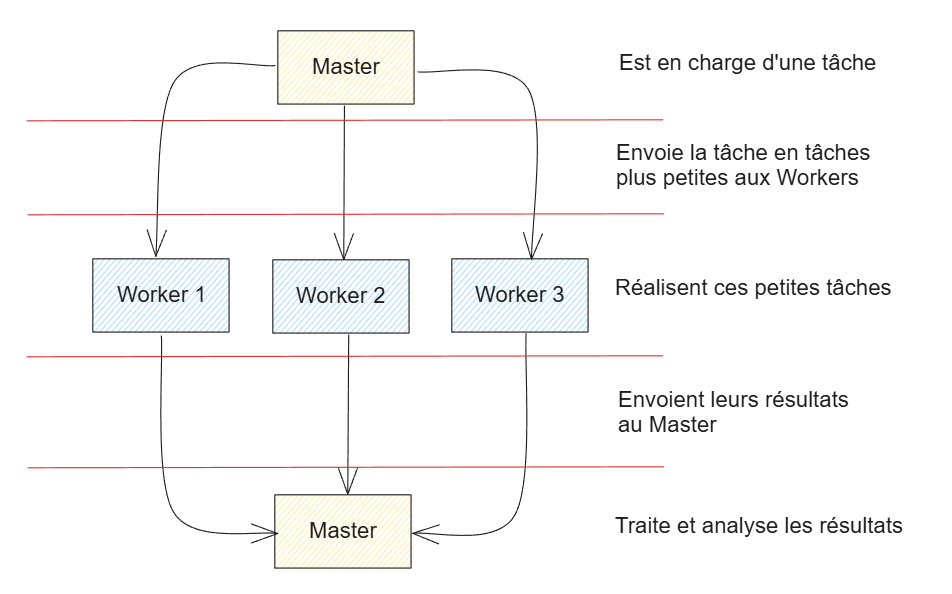

<h3 align="center">Projet Monte Carlo</h3>

<p align="center">
Ce projet est le résultat de plusieurs travaux pratiques dans les cours de programmation avancée et de qualité de développement de BUT Informatique. Il regroupe une étude complète de performance sur l'utilisation de l'algorithme de Monte-Carlo pour estimer Pi avec de la programmation parralèle et de la mémoire distribuée. Il comprend également une partie sur la norme ISO.
<br />
</p>
</div>
<div align="center">

[![Python][python]][python-url]
[![Java][java]][java-url]

[python]: https://img.shields.io/badge/python-3776AB?style=for-the-badge&logo=python&logoColor=white
[python-url]: https://www.python.org/
[java]: https://img.shields.io/badge/Java-000000?style=for-the-badge&logo=intellijidea&logoColor=white
[java-url]: https://www.java.com/fr/

</div>

> Réalisé par EwenDev  
> *La rédaction et la réalisation de ce document ont été réalisés avec l'aide d'outils d'intelligence artificielle et de mes camarades de BUT Informatique.*

<a href="#plan" align="center"><strong>Explorer la documentation »</strong></a>
<br />

## Plan

- [I - Utilisation de Monte-Carlo pour estimer Pi](#i---utilisation-de-monte-carlo-pour-estimer-pi)
- [II - Algorithmes et Approches de Parallélisation](#ii---algorithmes-et-approches-de-parallélisation)
  - [A - Parallélisation par Itération](#a---parallélisation-par-itération)
  - [B - Modèle Master/Worker](#b---modèle-masterworker)
- [III - Réalisation sur Machine](#iii---réalisation-sur-machine)
  - [A - Analyse d’Assignment102](#a---analyse-dassignment102)
  - [B - Analyse de Pi.java](#b---analyse-de-pijava)
- [IV - Évaluation des Performances](#iv---évaluation-des-performances)
  - [A - Évaluation via run.py](#a---évaluation-des-performances-via-runpy)
  - [B - Évaluation de la Scalabilité](#b---évaluation-de-la-scalabilité)
    - [1. Scalabilité Forte](#1---scalabilité-forte)
    - [2. Scalabilité Faible](#2---scalabilité-faible)
  - [C - Analyse des résultats de Assignment102.java](#c---analyse-des-résultats-de-assignment102java)
  - [D - Analyse des résultats de Pi.java](#d---analyse-des-résultats-de-pijava)
- [V - Mise en œuvre en mémoire distribuée](#v---mise-en-œuvre-en-mémoire-distribuée)
  - [A - Implémentation via Sockets](#a---implémentation-via-sockets)
  - [B - Tests de performance et orchestration via masterworker.py](#b---tests-de-performance-et-orchestration-via-masterworkerpy)
- [VI - Analyse des performances de l’implémentation par Sockets](#vi---analyse-des-performances-de-limplémentation-par-sockets)
- [VII - Expérimentation sur plusieurs machines (Mémoire Distribuée)](#vii---expérimentation-sur-plusieurs-machines-mémoire-distribuée)
- [VIII - Qualité de développement](#viii---qualité-de-développement)

---

## I - Utilisation de Monte-Carlo pour estimer Pi

La méthode de Monte-Carlo est une technique probabiliste permettant d'estimer la valeur de Pi. Voici comment elle fonctionne :

Considérons un quart de disque de rayon 1, dont l'aire est :

$A_{1/4d} = \frac{\pi r^2}{4} = \frac{\pi}{4}$

Et un carré de côté 1, dont l'aire $A_c$ est :

$A_c = 1^2 = 1$

En tirant des points $X_p(x_p, y_p)$ selon une loi uniforme dans l'intervalle $]0;1[$, la probabilité qu'un point soit dans le quart de disque est :

$P = \frac{A_{1/4d}}{A_c} = \frac{\pi}{4}$


*Graphique représentant une épreuve de Monte-Carlo*

En effectuant $n_{tot}$ tirages aléatoires et en comptant $n_{cible}$ points dans le quart de disque, on peut approximer $P$ par :

$P = \frac{n_{cible}}{n_{tot}} \approx \frac{\pi}{4}$

D'où :

$\pi \approx 4 \cdot \frac{n_{cible}}{n_{tot}}$

On en déduit que plus $n_{tot}$ est grand, plus l'estimation de $\pi$ est précise.

---

## II - Algorithmes et Approches de Parallélisation

Pour accélérer le calcul de π par la méthode Monte Carlo, deux stratégies de parallélisation peuvent être envisagées : la parallélisation par itération et le modèle Master/Worker.

### A - Parallélisation par Itération

Dans l’approche séquentielle de base, on effectue \(n_{tot}\) tirages et on incrémente un compteur pour chaque point satisfaisant la condition \(x^2 + y^2 \leq 1\). Le pseudo-code classique est le suivant :

```
n_cible = 0;
for (p = 0; n_tot > 0; n_tot--) {
    x_p = rand();  // Génération d'un nombre aléatoire entre 0 et 1
    y_p = rand();
    if ((x_p * x_p + y_p * y_p) < 1) {
        n_cible++;
    }
}
pi = 4 * n_cible / n_tot;
```

Pour passer à une version parallèle, il est nécessaire de décomposer le travail en plusieurs tâches indépendantes. Ainsi, on identifie :

1. **Tâche principale (T0) :** Réaliser les tirages et compter les points.
  - **Sous-tâche T0p1 :** Générer les coordonnées \((x_p, y_p)\).
  - **Sous-tâche T0p2 :** Vérifier la condition \(x_p^2 + y_p^2 < 1\) et mettre à jour le compteur.

2. **Tâche secondaire (T1) :** Calculer π après avoir obtenu le total des points valides, via l’expression  
   \(\pi = 4 \cdot \frac{n_{cible}}{n_{tot}}\).

Les dépendances clés sont les suivantes :

- **Dépendance entre T0 et T1 :** Le calcul de π ne peut débuter qu’après avoir accumulé le total \(n_{cible}\).
- **Ordre interne à T0 :** Il faut d’abord générer un point avant de pouvoir le vérifier.
- **Exécution concurrente :** La génération (T0p1) est totalement indépendante entre les tirages. La vérification (T0p2) peut aussi être réalisée en parallèle, mais l'incrémentation du compteur \(n_{cible}\) constitue une section critique car plusieurs threads pourraient y accéder simultanément.

Pour éviter les conflits d’accès, l’accès à \(n_{cible}\) doit être protégé, par exemple via des mécanismes de synchronisation ou en utilisant des compteurs locaux qui seront ensuite agrégés.

On peut ainsi proposer un pseudo-code parallèle en s’appuyant sur une fonction dédiée :

```
function TirerPoint() {
    x_p = rand();  // Génère un nombre aléatoire entre 0 et 1
    y_p = rand();
    return ((x_p * x_p + y_p * y_p) < 1);
}

n_cible = 0;
parallel for (p = 0; n_tot > 0; n_tot--) {
    if (TirerPoint()) {
        n_cible++;  // Opération critique, nécessitant une synchronisation
    }
}
pi = 4 * n_cible / n_tot;
```

Chaque appel à `TirerPoint()` est indépendant, ce qui permet d’exécuter plusieurs tirages simultanément, à l’exception de l’incrémentation du compteur, qui doit être réalisée de façon atomique.

### B - Modèle Master/Worker

Une autre approche consiste à adopter le paradigme Master/Worker. Ici, le travail total est découpé en sous-tâches, chaque Worker réalisant une partie des tirages de manière autonome, et le Master agrégeant ensuite les résultats.

Le principe est le suivant :

1. **Division du travail :** Le nombre total de tirages \(n_{tot}\) est réparti équitablement entre \(n_{workers}\) en assignant à chacun un sous-ensemble de \(n_{charge} = \frac{n_{tot}}{n_{workers}}\) tirages.
2. **Exécution locale :** Chaque Worker exécute une fonction de type `MCWorker()` qui réalise ses tirages et compte localement le nombre de points satisfaisant la condition.
3. **Agrégation :** Une fois les calculs terminés, le Master récupère les compteurs locaux, les additionne pour obtenir \(n_{cible}\), puis calcule π via l’expression standard.

Voici un pseudo-code illustrant cette approche :

```
function TirerPoint() {
    x_p = rand();  // Génère un nombre aléatoire entre 0 et 1
    y_p = rand();
    return ((x_p * x_p + y_p * y_p) < 1);
}

function MCWorker(n_charge) {
    n_cible_partiel = 0;
    for (p = 0; n_charge > 0; n_charge--) {
        if (TirerPoint()) {
            n_cible_partiel += 1;
        }
    }
    return n_cible_partiel;
}

n_charge = n_tot / n_workers;
ncibles = [array de taille n_workers];
parallel for (worker = 0; worker < n_workers; worker++) {
    ncibles[worker] = MCWorker(n_charge);
}
n_cible = somme(ncibles);
pi = 4 * n_cible / n_tot;
```

**Points clés de cette approche :**

- **Isolation des calculs :** Chaque Worker dispose de son propre compteur local, ce qui élimine les problèmes liés à l’accès concurrent au compteur global.
- **Agrégation centralisée :** Une fois tous les Workers terminés, le Master combine les résultats de manière simple, en sommant les compteurs locaux.
- **Avantages :** Cette méthode réduit la nécessité de synchronisation fréquente, améliore la scalabilité et est facilement adaptable à des environnements distribués (voir Partie VII).

---

## III - Réalisation sur Machine

Dans cette section, nous examinons deux implémentations concrètes de la méthode Monte Carlo pour estimer π. L’objectif est d’identifier le modèle de programmation parallèle et le paradigme utilisé dans chaque cas, et de vérifier leur conformité avec les algorithmes présentés en Partie II.

### A - Analyse d’Assignment102

L’implémentation *Assignment102* exploite l’API Concurrent pour paralléliser les tirages nécessaires au calcul de π via Monte Carlo. Voici les points clés :


#### Structure

- **Gestion des threads :**  
  Le code fait appel à un `ExecutorService` utilisant un pool de threads adaptatif, obtenu grâce à `newWorkStealingPool`. Cette approche permet de tirer avantage des cœurs disponibles en exécutant chaque tirage comme une tâche indépendante (implémentée via `Runnable`).

- **Synchronisation via AtomicInteger :**  
  Pour compter le nombre de points se trouvant dans le quart de cercle, l’implémentation utilise une variable partagée protégée par un compteur atomique (`AtomicInteger`). Cette solution sécurise les mises à jour concurrentes et évite les conflits d’accès entre threads.

#### Modèle et Paradigme

- **Modèle appliqué :**  
  La stratégie suivie est celle de l’itération parallèle, où chaque tirage est exécuté indépendamment, comme décrit en Partie II.A.

- **Paradigme :**  
  Chaque tâche correspond à un tirage unique, ce qui permet une exécution parallèle sans interdépendances, mis à part l’incrémentation critique du compteur.

#### Conformité avec le Pseudo-code

L’implémentation d’Assignment102 se rapproche étroitement du pseudo-code de l’itération parallèle, avec deux adaptations principales :
- Le compteur global `n_cible` est remplacé par un `AtomicInteger` pour garantir la sécurité des mises à jour.
- La gestion du découplage des threads est assurée par l’API `ExecutorService`.

#### Limites et Optimisations Possibles

- **Surcharge de synchronisation :**  
  L’opération d’incrémentation (`incrementAndGet()`) est relativement coûteuse en termes de synchronisation, ce qui peut entraîner jusqu’à 75 % du temps d’exécution consacré à cette gestion.

- **Pistes d’amélioration :**
  - **Accumulation Locale :** Chaque thread pourrait disposer de son propre compteur local, avec une agrégation finale pour réduire la contention sur la variable partagée.
  - **Révision du Comptage :** Une autre option consisterait à compter les points hors cible et à déduire ensuite la valeur de π en utilisant une formule ajustée.

En résumé, bien que l’implémentation soit claire et fonctionnelle, les problèmes liés aux synchronisations répétées limitent son évolutivité en environnement multithread.

---

### B - Analyse de Pi.java

L’implémentation *Pi.java* adopte une approche différente, basée sur l’utilisation des `Future` et des `Callable` pour paralléliser le calcul de π.


#### Présentation des `Future`

Un `Future` est un conteneur permettant de récupérer le résultat d’un calcul asynchrone. Il offre trois avantages principaux :
- **Soumission d’une Tâche :** Une tâche soumise à un pool de threads renvoie un `Future` encapsulant son résultat.
- **Récupération du Résultat :** L’appel à `get()` permet d’obtenir la valeur une fois le calcul terminé, créant ainsi une barrière de synchronisation implicite.
- **Suivi d’Exécution :** Il permet également de vérifier si la tâche est achevée ou si elle a rencontré une erreur.

#### Modèle et Paradigme

- **Modèle appliqué :**  
  Le paradigme Master/Worker est ici mis en œuvre. Le Master distribue le travail à plusieurs Workers (implémentés sous forme de `Callable<Long>`), et attend la fin de chaque tâche via leur `Future`.

- **Paradigme :**  
  Chaque Worker exécute une fonction similaire à `MCWorker()`, effectuant un sous-ensemble du nombre total de tirages. Une fois toutes les tâches complétées, le Master agrège les résultats pour calculer π.

#### Détails Structurels

1. **Utilisation des `Callables` :**  
   Chaque Worker, en tant que `Callable`, effectue un nombre déterminé d’itérations pour compter les points situés dans le quart de cercle. Ces tâches sont soumises à un pool de threads fixe (`FixedThreadPool`) pour assurer leur exécution simultanée.

2. **Agrégation via `Future` :**  
   Les résultats partiels, encapsulés dans des objets `Future`, sont récupérés par le Master à l’aide de `get()`. La somme de ces résultats permet d’obtenir le total des points valides, utilisé ensuite pour estimer π.

#### Conformité avec le Pseudo-code

Le déroulement de *Pi.java* suit rigoureusement la logique du modèle Master/Worker présenté en Partie II.B :
- Le Master répartit équitablement les tirages entre les Workers.
- Chaque Worker traite son sous-ensemble indépendamment.
- L’agrégation finale se fait en combinant les compteurs locaux issus des différents Workers.

#### Comparaison avec Assignment102

- **Calcul Localisé :**  
  Contrairement à Assignment102, chaque Worker de *Pi.java* réalise ses propres calculs, éliminant le besoin d’accès concurrent à une variable partagée.

- **Synchronisation Différée :**  
  L’utilisation des `Future` permet de retarder la synchronisation jusqu’à la phase d’agrégation, ce qui réduit considérablement les surcoûts liés aux accès concurrents.

- **Efficacité :**  
  Cette approche s’avère particulièrement efficace dans un environnement multithread, notamment sur des machines multicœurs, grâce à une gestion optimisée des ressources.

En résumé, *Pi.java* présente de meilleures performances en termes de parallélisation par rapport à Assignment102, notamment grâce à une réduction significative des coûts de synchronisation et une isolation accrue des calculs.

---

## IV - Évaluation des Performances

La machine sur lesquels vont être réalisés les tests possède les spécifications suivantes :

- Intel Core i5-12500H
- 12 cœurs physiques
- 16 cœurs logiques (4 Performance-cores, 8 Efficient-cores)

### A - Évaluation des performances via run.py

Pour mesurer et comparer les performances des implémentations, nous avons développé un script Python, **run.py**, qui orchestre l'exécution des tests sur les deux versions principales (notamment *Pi.java* et *Assignment102.java*). Ce script automatisé se charge de :

- **Lancement des tests :**  
  Il exécute plusieurs fois chaque implémentation Java en variant le nombre de processus et le nombre total d’itérations. Deux modes sont proposés :
    - **Scalabilité forte :** Le nombre total d’itérations reste constant alors que l’on fait varier le nombre de processus.
    - **Scalabilité faible :** La charge totale (nombre d’itérations) est augmentée proportionnellement au nombre de processus, de façon à maintenir une charge identique par processus.

- **Redondance des mesures :**  
  Chaque test est répété un certain nombre de fois (paramètre défini par `DATA_REDUDENCY`) pour obtenir des résultats cohérents et atténuer les variations liées aux fluctuations temporaires des performances.

- **Collecte et traitement des données :**  
  Les résultats (temps d’exécution, approximation de π, etc.) sont enregistrés dans des fichiers texte. Le script lit ensuite ces fichiers pour extraire les temps moyens et calculer les speedups, en comparant les temps d’exécution pour différentes configurations.

- **Visualisation des résultats :**  
  À l’aide de matplotlib, run.py génère des graphiques illustrant la scalabilité forte et faible. Ces graphiques affichent, en parallèle avec la courbe idéale, l’évolution du speedup en fonction du nombre de processus utilisés.

Ce dispositif permet une analyse fine des performances, en mettant en lumière l’impact de la parallélisation sur le temps d’exécution et la précision du calcul de π pour chaque implémentation. Il offre ainsi une base solide pour comparer l’efficacité des différentes approches et identifier les points à optimiser.

### B - Évaluation de la Scalabilité

Pour évaluer l'efficacité des implémentations, nous avons mené des tests visant à mesurer leur capacité à exploiter des ressources additionnelles. Ces tests se déclinent en deux approches distinctes : la scalabilité forte et la scalabilité faible.

#### 1 - Scalabilité Forte

La scalabilité forte consiste à analyser la réduction du temps d'exécution lorsque l'on augmente le nombre de processeurs, tout en conservant une charge de travail totale constante. Le gain de performance se quantifie par le **speedup**, défini comme :

```
Speedup = Temps d'exécution sur 1 cœur / Temps d'exécution sur N cœurs
```

Dans un scénario idéal, le speedup devrait croître de façon linéaire avec l'augmentation du nombre de cœurs, ce qui indiquerait une utilisation optimale des ressources. 


Par exemple, pour un total de 1 000 000 de points, nous répartissons les tâches de la manière suivante :

- **1 cœur :** 1 000 000 points,
- **2 cœurs :** 500 000 points par cœur,
- **4 cœurs :** 250 000 points par cœur,
- **8 cœurs :** 125 000 points par cœur,
- **16 cœurs :** 62 500 points par cœur.

Des configurations similaires sont utilisées pour des charges globales de 10 000 000 et 100 000 000 de points.

#### 2 - Scalabilité Faible

La scalabilité faible évalue la capacité d'un programme à maintenir un temps d'exécution stable lorsque l'on augmente proportionnellement la charge totale avec le nombre de cœurs. Autrement dit, l'objectif est de conserver une charge identique par processeur, ce qui correspond à un speedup idéal constant (égal à 1).

Pour illustrer ce test, chaque cœur se voit attribuer un nombre fixe de points à traiter (par exemple, 1 000 000). Ainsi, avec :

- **1 cœur :** 1 000 000 points au total,
- **2 cœurs :** 2 000 000 points (1 000 000 par cœur),
- **4 cœurs :** 4 000 000 points,
- **8 cœurs :** 8 000 000 points,
- **16 cœurs :** 16 000 000 points.

Des scénarios analogues sont établis pour d'autres charges globales, notamment 10 000 000 et 100 000 000 de points, garantissant que chaque cœur traite la même quantité de travail quel que soit le nombre total de cœurs.

Ces tests de scalabilité permettent de comparer de manière fine l'utilisation des ressources par chaque implémentation, en identifiant notamment les surcoûts liés à la synchronisation ou les limitations dues à des goulots d'étranglement. Les résultats obtenus seront ensuite présentés sous forme de tableaux et de graphiques, facilitant ainsi l'analyse de l'évolution du speedup en fonction du nombre de cœurs.

### C - Analyse des résultats de Assignment102.java

#### **A - Scalabilité Faible**

Dans ce scénario, chaque cœur traite la même quantité de points (12 000 000). Le nombre total de points est donc proportionnel au nombre de cœurs.

| **# Cœurs** | **Points Lancés** | **Points/Cœur** | **Temps Exéc. (ms)** | **Erreur Rel.** |
|------------:|------------------:|----------------:|---------------------:|----------------:|
|           1 |        12 000 000 |      12 000 000 |              1 115,6 |       9,04×10⁻⁵ |
|           2 |        24 000 000 |      12 000 000 |              2 253,8 |       1,04×10⁻⁴ |
|           3 |        36 000 000 |      12 000 000 |              3 232,8 |       6,65×10⁻⁵ |
|           4 |        48 000 000 |      12 000 000 |              4 410,4 |       2,98×10⁻⁵ |
|           5 |        60 000 000 |      12 000 000 |              5 559,0 |       8,46×10⁻⁵ |
|           6 |        72 000 000 |      12 000 000 |              6 635,6 |       5,53×10⁻⁵ |
|           7 |        84 000 000 |      12 000 000 |              7 980,4 |       3,26×10⁻⁵ |
|           8 |        96 000 000 |      12 000 000 |              9 108,2 |       4,89×10⁻⁵ |
|           9 |       108 000 000 |      12 000 000 |             10 154,4 |       4,00×10⁻⁵ |
|          10 |       120 000 000 |      12 000 000 |             11 698,8 |       3,04×10⁻⁵ |
|          11 |       132 000 000 |      12 000 000 |             12 747,4 |       4,59×10⁻⁵ |
|          12 |       144 000 000 |      12 000 000 |             13 909,8 |       3,29×10⁻⁵ |
|          13 |       156 000 000 |      12 000 000 |             17 494,4 |       2,34×10⁻⁵ |
|          14 |       168 000 000 |      12 000 000 |             18 916,8 |       4,69×10⁻⁵ |
|          15 |       180 000 000 |      12 000 000 |             20 543,8 |       2,92×10⁻⁵ |
|          16 |       192 000 000 |      12 000 000 |             22 458,0 |       4,57×10⁻⁵ |

**Observations** :
- Le temps d’exécution augmente presque linéairement avec le nombre total de points, ce qui laisse le **speedup** proche de 1.
- L’erreur relative reste globalement de l’ordre de 10⁻⁵ à 10⁻⁴.


---

#### **B - Scalabilité Forte**

Ici, le total de points est fixé à 12 000 000. Chaque cœur en traite donc une fraction égale. On espère que le temps d’exécution diminue sensiblement quand on augmente le nombre de cœurs.

| **# Cœurs** | **Points Lancés** | **Points/Cœur** | **Temps Exéc. (ms)** | **Erreur Rel.** |
|------------:|------------------:|----------------:|---------------------:|----------------:|
|           1 |        12 000 000 |      12 000 000 |              1 145,2 |       1,27×10⁻⁴ |
|           2 |        12 000 000 |       6 000 000 |              1 106,0 |       1,14×10⁻⁴ |
|           3 |        12 000 000 |       4 000 000 |              1 110,6 |       1,34×10⁻⁴ |
|           4 |        12 000 000 |       3 000 000 |              1 104,0 |       1,33×10⁻⁴ |
|           5 |        12 000 000 |       2 400 000 |              1 102,8 |       1,96×10⁻⁴ |
|           6 |        12 000 000 |       2 000 000 |              1 105,6 |       1,09×10⁻⁴ |
|           7 |        12 000 000 |      ~1 714 286 |              1 102,6 |       1,47×10⁻⁴ |
|           8 |        12 000 000 |       1 500 000 |              1 112,2 |       1,32×10⁻⁴ |
|           9 |        12 000 000 |      ~1 333 333 |              1 103,2 |       1,03×10⁻⁴ |
|          10 |        12 000 000 |       1 200 000 |              1 108,4 |       1,07×10⁻⁴ |
|          11 |        12 000 000 |      ~1 090 909 |              1 109,0 |        9,40×10⁵ |
|          12 |        12 000 000 |       1 000 000 |              1 158,6 |        8,71×10⁵ |
|          13 |        12 000 000 |        ~923 077 |              1 135,0 |       1,17×10⁻⁴ |
|          14 |        12 000 000 |        ~857 143 |              1 099,6 |       1,07×10⁻⁴ |
|          15 |        12 000 000 |         800 000 |              1 114,0 |       1,35×10⁻⁴ |
|          16 |        12 000 000 |         750 000 |              1 118,8 |       1,88×10⁻⁴ |

**Observations** :
- Le temps d’exécution ne décroît pas proportionnellement au nombre de cœurs. Le **speedup** reste modeste (souvent < 2), traduisant une mauvaise exploitation du parallélisme.
- La variable partagée via `AtomicInteger` provoque un **goulot d’étranglement** et limite fortement les gains attendus lorsque le nombre de threads augmente.


#### Erreur

Le nuage d’erreurs présente une dispersion notable, avec certains points dépassant $10^{-4}$ voire $10^{-3}$. Malgré ces fluctuations, la médiane (environ $3.64 \times 10^{-5}$) reste relativement faible, indiquant une estimation de $\pi$ globalement correcte, mais plus sujette à des écarts importants en raison des accès atomiques et de la synchronisation coûteuse.


#### Interprétation

Les tableaux ci-dessus confirment que la synchronisation intensive autour d’un compteur atomique empêche *Assignment102* d’exploiter efficacement plusieurs cœurs :

**Scalabilité faible** : 
- Le temps augmente presque linéairement avec le nombre total de points, suggérant que l’ajout de cœurs ne sert qu’à répartir la même surcharge de synchronisation sur plus de threads.
**Scalabilité forte** : 
- Le temps ne diminue que très légèrement en ajoutant des cœurs, démontrant un speedup loin d’être linéaire et un parallélisme très limité.

Dans l’ensemble, si *Assignment102* fournit des estimations correctes de π, son implémentation reste mal adaptée aux environnements multithread à grande échelle.


### D - Analyse des résultats de Pi.java

#### A - Scalabilité Faible (Pi.java)

En **scalabilité faible**, chaque cœur traite 12 000 000 de points. Le nombre total de points est donc égal à \(12 \times \text{(nombre de cœurs)}\).

| **# Cœurs** | **Points Lancés** | **Points/Cœur** | **Temps Exéc. (ms)** | **Erreur Rel.** |
|------------:|------------------:|----------------:|---------------------:|----------------:|
|           1 |        12 000 000 |      12 000 000 |                410.8 |       1.03×10⁻⁴ |
|           2 |        24 000 000 |      12 000 000 |                426.2 |        6.2×10⁻⁵ |
|           3 |        36 000 000 |      12 000 000 |                439.0 |        7.0×10⁻⁵ |
|           4 |        48 000 000 |      12 000 000 |                443.2 |        7.2×10⁻⁵ |
|           5 |        60 000 000 |      12 000 000 |                448.0 |        7.1×10⁻⁵ |
|           6 |        72 000 000 |      12 000 000 |                464.2 |        4.2×10⁻⁵ |
|           7 |        84 000 000 |      12 000 000 |                473.4 |        4.4×10⁻⁵ |
|           8 |        96 000 000 |      12 000 000 |                485.0 |        6.0×10⁻⁵ |
|           9 |       108 000 000 |      12 000 000 |                498.8 |        1.5×10⁻⁵ |
|          10 |       120 000 000 |      12 000 000 |                512.4 |        3.1×10⁻⁵ |
|          11 |       132 000 000 |      12 000 000 |                519.8 |        2.7×10⁻⁵ |
|          12 |       144 000 000 |      12 000 000 |                531.2 |        2.3×10⁻⁵ |
|          13 |       156 000 000 |      12 000 000 |                536.4 |        3.1×10⁻⁵ |
|          14 |       168 000 000 |      12 000 000 |                551.8 |        2.9×10⁻⁵ |
|          15 |       180 000 000 |      12 000 000 |                562.0 |        3.5×10⁻⁵ |
|          16 |       192 000 000 |      12 000 000 |                680.0 |        1.3×10⁻⁵ |

**Observations :** 
- Dans l’idéal, pour une scalabilité faible, le temps d’exécution devrait rester à peu près constant (speedup ~ 1). Ici, le temps augmente lentement avec le nombre de cœurs, ce qui reste un résultat correct pour un modèle où l’on accroît simultanément la charge et le nombre de threads.


#### B - Scalabilité Forte (Pi.java)

En **scalabilité forte**, le total de points est fixé à **12 000 000** et partagé entre les cœurs.

| **# Cœurs** | **Points Lancés** | **Points/Cœur** | **Temps Exéc. (ms)** | **Erreur Rel.** |
|------------:|------------------:|----------------:|---------------------:|----------------:|
|           1 |        12 000 000 |      12 000 000 |                409.8 |        1.9×10⁻⁴ |
|           2 |        12 000 000 |       6 000 000 |                221.0 |        1.3×10⁻⁴ |
|           3 |        12 000 000 |       4 000 000 |                158.0 |        8.3×10⁻⁵ |
|           4 |        12 000 000 |       3 000 000 |                124.6 |        5.8×10⁻⁵ |
|           5 |        12 000 000 |       2 400 000 |                109.0 |        1.4×10⁻⁴ |
|           6 |        12 000 000 |       2 000 000 |                 96.6 |        1.1×10⁻⁴ |
|           7 |        12 000 000 |      ~1 714 286 |                 96.0 |        4.6×10⁻⁵ |
|           8 |        12 000 000 |       1 500 000 |                 89.4 |        1.1×10⁻⁴ |
|           9 |        12 000 000 |      ~1 333 333 |                 82.4 |        1.4×10⁻⁴ |
|          10 |        12 000 000 |       1 200 000 |                 80.4 |        9.1×10⁻⁵ |
|          11 |        12 000 000 |      ~1 090 909 |                 78.2 |        1.9×10⁻⁴ |
|          12 |        12 000 000 |       1 000 000 |                 78.4 |        1.9×10⁻⁴ |
|          13 |        12 000 000 |        ~923 077 |                 74.6 |        7.8×10⁻⁵ |
|          14 |        12 000 000 |        ~857 143 |                 69.4 |        1.6×10⁻⁴ |
|          15 |        12 000 000 |         800 000 |                 74.0 |        8.2×10⁻⁵ |
|          16 |        12 000 000 |         750 000 |                 76.2 |        1.2×10⁻⁴ |

**Observations :** 
- Pour une scalabilité forte idéale, le temps devrait baisser linéairement en ajoutant des cœurs (speedup ~ nombre de cœurs). Ici, le temps diminue effectivement de manière importante (de 410 ms à ~76 ms entre 1 et 16 cœurs), témoignant d’un **bien meilleur speedup** que dans l’implémentation *Assignment102*.


#### Erreur

Les erreurs se répartissent majoritairement en dessous de $10^{-4}$, avec une médiane autour de $3.25 \times 10^{-5}$. Le nuage montre moins de points extrêmes que pour Assignment102, ce qui traduit une meilleure stabilité de l’estimation. Le recours à des `Callables` et des `Futures` limite la contention et se traduit par une erreur plus homogène.


#### Interprétation

**Scalabilité Faible :**
  - Le temps augmente avec le nombre de cœurs, mais moins rapidement que la charge totale. Le programme parvient donc à conserver un temps d’exécution relativement maîtrisé, ce qui indique une répartition efficace de la charge sur plusieurs threads.

**Scalabilité Forte :**
  - Le temps diminue significativement à mesure que l’on augmente le nombre de cœurs, révélant un **speedup** presque linéaire jusqu’à 8 ou 10 cœurs, puis un léger tassement au-delà. Cela montre une bonne exploitation du parallélisme.

En comparaison avec *Assignment102*, l’implémentation *Pi.java* fait un usage plus efficace des ressources multithread grâce à des compteurs locaux (agrégés via `Future`) et à une synchronisation moins intrusive. Elle parvient ainsi à tirer pleinement profit des architectures multicœurs, comme le confirment les **temps d’exécution** et **erreurs relatives** présentés ci-dessus.


---

## V - Mise en œuvre en mémoire distribuée

Dans cette section, nous abordons l'adaptation de notre méthode Monte Carlo pour le calcul de π à un environnement distribué. Cette approche repose sur le modèle Master/Worker implémenté à l'aide de communications par sockets. Contrairement aux implémentations en mémoire partagée, cette solution permet de répartir la charge de calcul sur plusieurs machines, chaque Worker exécutant localement la simulation Monte Carlo, tandis que le Master coordonne les échanges et agrège les résultats.



### A - Implémentation via Sockets

Pour porter l'algorithme sur une architecture distribuée, deux classes Java principales ont été développées :

- **MasterSocket.java**  
  Cette classe se charge de la coordination globale. Elle se connecte à un ensemble de WorkerSockets sur des ports préconfigurés (voir le tableau `tab_port` dans le code), répartit équitablement le nombre d'itérations à exécuter selon le mode de scalabilité choisi (forte ou faible), et agrège les résultats renvoyés par les workers pour estimer π. Le résultat final, ainsi que diverses métriques (nombre total d'itérations, nombre de workers, durée d'exécution, erreur relative), est ensuite enregistré dans un fichier de sortie spécifique.

- **WorkerSocket.java**  
  Chaque instance de cette classe écoute sur un port déterminé, attend la commande du MasterSocket, exécute la simulation Monte Carlo sur le nombre d'itérations reçu, et renvoie le nombre de points se trouvant dans le quart de cercle. Ce mode de fonctionnement permet de décharger le calcul de π sur plusieurs machines ou processus indépendants.


### B - Tests de performance et orchestration via masterworker.py

Pour évaluer cette implémentation distribuée, un script Python nommé **masterworker.py** a été développé. Ce script automatise l'exécution des tests et offre les fonctionnalités suivantes :

- **Lancement des Workers :**  
  La fonction `launch_workers_for()` démarre un nombre donné d'instances de WorkerSocket sur des ports prédéfinis. Chaque worker est lancé sur un port spécifique (voir le tableau `WORKER_PORTS`), garantissant ainsi la disponibilité de multiples canaux de communication.

- **Exécution du MasterSocket :**  
  La fonction `run_master_socket()` initie le MasterSocket avec les paramètres appropriés (nombre d'itérations, nombre de workers, et mode de scalabilité "forte" ou "faible"). Une fois l'exécution terminée, elle assure la terminaison propre de tous les workers.

- **Génération des données de test :**  
  Deux fonctions, `generate_data_scal_forte_socket()` et `generate_data_scal_faible_socket()`, permettent de lancer les tests pour la scalabilité forte et faible respectivement. En scalabilité forte, le nombre total d'itérations reste constant alors que le nombre de workers varie. En scalabilité faible, chaque worker reçoit une charge fixe, et le nombre total d'itérations augmente proportionnellement au nombre de workers.

- **Traitement et visualisation des résultats :**  
  Le script lit les fichiers de sortie générés par MasterSocket (format : nombre d’itérations total, erreur relative, nombre de workers, durée d'exécution), calcule les speedups obtenus en fonction du nombre de workers, et affiche des courbes comparatives pour la scalabilité forte et faible à l'aide de matplotlib.

En résumé, cette approche par sockets démontre l’efficacité d’une mise en œuvre en mémoire distribuée pour le calcul de π via la méthode Monte Carlo. L'architecture permet une bonne évolutivité, tant en scalabilité forte (charge totale fixe) qu'en scalabilité faible (charge par worker constante), et constitue une solution intéressante pour exploiter des environnements multi-machines.

---

## VI - Analyse des performances de l’implémentation par Sockets

Cette section décrit les performances de l’implémentation Master/Worker utilisant des **Sockets**, puis compare les observations à celles de l’implémentation **Pi.java** en mémoire partagée.

### A - Résultats Sockets

#### 1 - Scalabilité Faible

En **scalabilité faible**, chaque worker traite un nombre fixe de points (12 000 000). Le total d’itérations est donc proportionnel au nombre de workers.

| **# Workers** | **Points Lancés** | **Points/Worker** | **Temps Exéc. (ms)** | **Erreur Rel.** |
|--------------:|------------------:|------------------:|---------------------:|----------------:|
|             1 |        12 000 000 |        12 000 000 |                414.2 |       1.39×10⁻⁴ |
|             2 |        24 000 000 |        12 000 000 |                420.0 |       8.29×10⁻⁵ |
|             3 |        36 000 000 |        12 000 000 |                432.0 |       4.25×10⁻⁵ |
|             4 |        48 000 000 |        12 000 000 |                441.8 |       1.86×10⁻⁵ |
|             5 |        60 000 000 |        12 000 000 |                471.0 |       3.86×10⁻⁵ |
|             6 |        72 000 000 |        12 000 000 |                492.0 |       5.17×10⁻⁵ |
|             7 |        84 000 000 |        12 000 000 |                499.2 |       8.04×10⁻⁵ |
|             8 |        96 000 000 |        12 000 000 |                509.0 |       5.34×10⁻⁵ |

- **Interprétation :**
  - En théorie, la **scalabilité faible** voudrait que le temps reste stable en ajoutant des workers, puisque la charge par worker est fixe. Ici, on constate une augmentation modérée du temps d’exécution (de ~414 ms à ~509 ms), ce qui demeure logique vu l’**overhead** lié aux communications par sockets.
  - L’erreur relative reste de l’ordre de 10⁻⁴ ou moins, garantissant une bonne précision.


#### 2 - Scalabilité Forte

En **scalabilité forte**, on fixe le total de 12 000 000 de points, répartis équitablement entre les workers.

| **# Workers** | **Points Lancés** | **Points/Worker** | **Temps Exéc. (ms)** | **Erreur Rel.** |
|--------------:|------------------:|------------------:|---------------------:|----------------:|
|             1 |        12 000 000 |        12 000 000 |                414.6 |       7.14×10⁻⁵ |
|             2 |        12 000 000 |         6 000 000 |                211.0 |       1.35×10⁻⁴ |
|             3 |        12 000 000 |         4 000 000 |                149.8 |       8.79×10⁻⁵ |
|             4 |        12 000 000 |         3 000 000 |                120.4 |       7.58×10⁻⁵ |
|             5 |        12 000 000 |         2 400 000 |                103.6 |       1.07×10⁻⁴ |
|             6 |        12 000 000 |         2 000 000 |                 96.6 |       1.11×10⁻⁴ |
|             7 |        12 000 000 |        ~1 714 286 |                 86.2 |       2.17×10⁻⁴ |
|             8 |        12 000 000 |         1 500 000 |                 74.2 |       3.18×10⁻⁴ |

- **Interprétation :**
  - On observe une **diminution importante** du temps d’exécution lorsque le nombre de workers augmente, passant d’environ 415 ms à 74 ms (soit un speedup > 5).
  - Les résultats traduisent une **bonne scalabilité forte**, malgré un certain overhead dû aux échanges réseau.


#### Erreur avec les sockets

Ici, la médiane avoisine $4.28 \times 10^{-5}$. Les points se concentrent autour de valeurs similaires, parfois un peu au-dessus ou en dessous de $10^{-5}$. L’implémentation distribuée n’accuse pas de grandes fluctuations, signe que la communication par sockets n’a pas introduit de variabilité excessive, tout en conservant une précision satisfaisante pour le calcul de $\pi$.


### B - Comparaison avec Pi.java (mémoire partagée)

Pour rappel, l’implémentation **Pi.java** utilise un modèle Master/Worker en mémoire partagée, en recourant à des `Callable` et `Future`. Voici les grandes tendances observées avec Pi.java :

- **Scalabilité Faible (Pi.java)** :  
  Le temps monte lentement lorsqu’on augmente le nombre de cœurs et la charge totale, restant toutefois dans des valeurs raisonnables. L’augmentation est parfois moins prononcée qu’avec Sockets, car il n’y a pas de surcoût réseau.

- **Scalabilité Forte (Pi.java)** :  
  Le temps d’exécution diminue presque linéairement jusqu’à un certain seuil (autour de 8–10 cœurs), montrant un speedup proche de la courbe idéale. Là aussi, l’absence de communication réseau favorise un overhead moindre que dans le cas des Sockets.

#### Synthèse comparative

1. **Overhead de communication** :
  - **Pi.java (local)** ne subit pas le surcoût de la communication réseau, puisqu’il fonctionne sur une seule machine.
  - **Sockets (distribué)** introduit un échange réseau pour chaque Worker, ce qui augmente légèrement le temps global, surtout quand le nombre de workers devient élevé.

2. **Précision** :
  - Les deux approches (Pi.java et Sockets) aboutissent à des erreurs relatives similaires (typiquement inférieures à 10⁻⁴). L’estimation de π reste fiable dans les deux cas.

3. **Limites de scalabilité** :
  - **Pi.java** peut saturer au-delà de 8–16 cœurs sur une même machine, notamment à cause du partage des ressources CPU et de la synchronisation.
  - **Sockets** peut continuer à s’étendre sur plusieurs machines, mais le gain se voit parfois freiné par le **coût des communications** et la répartition des données sur un réseau plus large.

En résumé, **Pi.java** tire avantage d’une synchronisation locale moins coûteuse, ce qui explique des performances parfois meilleures sur une unique machine, surtout pour un nombre de cœurs modéré. En revanche, l’implémentation **Sockets** se prête mieux à une exécution sur plusieurs machines physiques, où la distribution des ressources l’emporte sur le surcoût de communication, permettant de monter en charge au-delà des limites d’une seule machine.

### Conclusion

- **Sockets** :
  - **Scalabilité forte** satisfaisante, avec un speedup notable lorsque le nombre de workers passe de 1 à 8.
  - **Scalabilité faible** plus coûteuse que Pi.java sur une seule machine, en raison des échanges réseau.
  - Permet l’extension à plusieurs machines physiques.

- **Pi.java** :
  - **Scalabilité forte** excellente en local, avec peu d’overhead de synchronisation.
  - **Scalabilité faible** également raisonnable, mais limitée à un seul nœud.
  - Ne s’étend pas naturellement à une exécution multi-machines.

Le choix entre ces deux implémentations dépend donc principalement de l’environnement visé : **Pi.java** est adapté à une machine multicœurs unique, tandis que l’approche **Sockets** prend tout son sens lorsque l’on souhaite répartir la charge sur plusieurs hôtes distincts.


---

## VII - Expérimentation sur plusieurs machines (Mémoire Distribuée)

Après avoir validé l’approche sockets sur une seule machine, nous avons étendu l’expérience à un environnement réellement distribué, en mobilisant plusieurs postes de la salle G26. Chaque machine héberge un ou plusieurs **WorkerSocket**, tandis qu’un **MasterSocket** dédié coordonne le calcul de π par la méthode de Monte Carlo. Cette section détaille la mise en place et les résultats obtenus.

### A - Mise en place de l’expérience

1. **Préparation des machines**
  - Installation de Java et désactivation du pare-feu pour autoriser les connexions sur les ports dédiés :
    ```bash
    sudo yum install java-devel
    sudo systemctl stop firewalld
    ```
  - Compilation et exécution des classes `WorkerSocket` et `MasterSocket` sur chaque machine.
  - Adaptation du code pour gérer les adresses IP locales (fichier `MasterSocketNetwork` et `WorkerSocketNetwork`).

2. **Double parallélisation**
  - Chaque machine dispose de plusieurs cœurs, permettant de lancer **4 workers par machine**.
  - Sur le plan réseau, plusieurs machines sont connectées pour exécuter un nombre total de workers croissant (1, 2, 4, 8, 16, 32, 64).
  - Ainsi, on combine **parallélisme local** (plusieurs workers sur une même machine) et **parallélisme distribué** (plusieurs machines).


### B - Tableau récapitulatif des résultats

Les tests ont été menés pour un nombre de points par worker fixé à \(2 \times 10^9\). Ainsi, lorsque l’on double le nombre de workers, le total de points calculés double également. Le tableau ci-dessous regroupe les résultats : nombre de machines, nombre total de workers, nombre total de points, temps d’exécution et erreur relative moyenne.

| **Machines** | **Workers** |     **Points Totaux** | **Durée (ms)** | **Erreur Rel.** |
|-------------:|------------:|----------------------:|---------------:|----------------:|
|            1 |           1 |       $2 \times 10^9$ |         68 974 |       2.36×10⁻⁵ |
|            1 |           2 |       $4 \times 10^9$ |         69 189 |       1.02×10⁻⁵ |
|            1 |           4 |      \(8 \times 10^9$ |         70 436 |       1.07×10⁻⁵ |
|            2 |           8 |  $1.6 \times 10^{10}$ |         70 450 |       4.61×10⁻⁶ |
|            4 |          16 |  $3.2 \times 10^{10}$ |         71 908 |       2.83×10⁻⁶ |
|            8 |          32 |  $6.4 \times 10^{10}$ |         70 484 |       1.28×10⁻⁶ |
|           16 |          64 | $1.28 \times 10^{11}$ |         70 890 |       1.37×10⁻⁶ |

> **Remarque :** Chaque machine exécute **4** workers, d’où le lien entre « Nombre de machines » et « Nombre de workers ».

### C - Analyse des résultats

1. **Stabilité du temps d’exécution**
  - On constate que la durée reste dans la fourchette de **70 à 72 secondes**, même lorsque le total de points passe de $2 \times 10^9$ à $1.28 \times 10^{11}$.
  - Cette constance du temps de calcul, malgré la multiplication par 64 de la charge globale, illustre une **excellente scalabilité faible** : chaque nouvelle machine apporte la puissance de calcul nécessaire pour absorber la part supplémentaire de travail.

2. **Diminution de l’erreur**
  - L’erreur relative diminue sensiblement (de 10⁻⁵ à 10⁻⁶) à mesure que le nombre de points total augmente.
  - Cet effet confirme l’intérêt de la méthode Monte Carlo : plus on lance de points, plus l’estimation de π s’affine (loi des grands nombres).

3. **Impact de la communication réseau**
  - Malgré la répartition du calcul sur plusieurs machines, le **coût de la communication** reste négligeable face au temps global de calcul.
  - Le modèle Master/Worker, où chaque worker travaille de façon autonome et renvoie simplement un compteur local, minimise la quantité de données échangées.

4. **Comparaison avec les expériences en local**
  - Les expériences sur une seule machine (ou un seul worker) présentaient un temps avoisinant déjà 68–70 secondes pour $2 \times 10^9$ points.
  - Ici, lorsque l’on augmente massivement le nombre de points (jusqu’à $1.28 \times 10^{11}$), le temps total **ne croît quasiment pas**, ce qui est nettement supérieur aux résultats observés en mémoire partagée sur une seule machine (où l’on finissait par saturer les ressources CPU).

### D - Conclusion

L’expérience en réseau local, mobilisant jusqu’à 16 machines (64 workers), met en évidence la **robustesse** et l’**efficacité** du modèle Master/Worker distribué :

- **Scalabilité faible presque idéale** : le temps reste stable autour de 70 secondes, alors que le total de points est multiplié par 64.
- **Précision accrue** : l’erreur relative descend à environ 10⁻⁶, confirmant la convergence de la méthode de Monte Carlo.
- **Faible overhead réseau** : les communications entre Master et Workers ne pénalisent pas le calcul, grâce à un échange de données minimal (simple comptage local puis agrégation).

Cette démonstration pratique souligne l’intérêt de la **programmation distribuée** pour les problèmes hautement parallélisables. En exploitant la puissance de calcul de plusieurs hôtes, on maintient un temps d’exécution quasiment constant tout en améliorant la précision du résultat. Cela illustre parfaitement la notion de **scalabilité faible** : l’ajout de ressources proportionnelles à la charge de travail préserve le temps total de calcul.

---

## VIII - Qualité de développement

### **Introduction aux Normes ISO en Informatique**

Les normes ISO, conçues par l’**Organisation internationale de normalisation**, ont pour but de définir des lignes directrices visant à garantir la qualité, la sécurité et la fiabilité des produits et services à l’échelle internationale. Dans le secteur des technologies de l’information, différentes normes ont vu le jour pour encadrer et évaluer la qualité des logiciels, parmi lesquelles on distingue notamment **ISO/IEC 9126** et **ISO/IEC 25010**.

#### **Évolution Historique des Normes de Qualité Logicielle**

##### **ISO/IEC 9126 : La Base Historique**

Publiée initialement en **1991**, la norme ISO/IEC 9126 a proposé l’une des premières approches méthodiques pour juger la qualité d’un logiciel. Elle identifiait alors **six grandes catégories** :

1. **Fonctionnalité (Functional Suitability)**
2. **Efficacité (Performance Efficiency)**
3. **Facilité d’utilisation (Usability)**
4. **Fiabilité (Reliability)**
5. **Maintenabilité (Maintainability)**
6. **Portabilité (Portability)**

Au fil du temps, cette norme a été subdivisée pour traiter séparément la **qualité interne**, la **qualité externe**, la **qualité en utilisation** et les **méthodes de mesure**. Cependant, les évolutions technologiques ont amené à la mise en place d’une norme plus complète, intégrant davantage de critères et mieux adaptée aux besoins contemporains.

##### **ISO/IEC 25010 : Le Modèle SQuaRE**

Publiée en **2011**, la norme **ISO/IEC 25010** s’intègre au cadre **SQuaRE** (Systems and software Quality Requirements and Evaluation). Elle reprend les catégories de l’ISO/IEC 9126, en les complétant par deux nouveaux axes :

1. **Sécurité (Security)** : protection et confidentialité des données, gestion des risques d’attaques.
2. **Compatibilité (Compatibility)** : capacité à coexister et interagir avec d’autres systèmes ou environnements.

Le modèle SQuaRE se révèle ainsi plus large et plus détaillé, répondant aux enjeux de fiabilité, d’efficacité et de sécurité des logiciels actuels.

##### **ISO/IEC 25041 : Guide d’Évaluation**

Pour faciliter l’adoption de la norme ISO/IEC 25010, le guide **ISO/IEC 25041** propose un processus en **quatre étapes** :

1. **Déterminer les exigences de qualité** : clarifier les attentes et les besoins des différentes parties prenantes.
2. **Élaborer un modèle de qualité** : utiliser les huit critères de l’ISO/IEC 25010 pour structurer l’analyse.
3. **Sélectionner des métriques** : s’appuyer sur la norme **ISO/IEC 25002** pour définir des indicateurs pertinents.
4. **Procéder à l’évaluation** : mesurer les indicateurs, interpréter les résultats et formuler des pistes d’amélioration.

---

### **Portée de la Norme ISO 25010**

La norme ISO 25010 présente deux modèles pour évaluer la qualité d’un logiciel ou d’un système :

1. **Quality in Use Model** (Qualité en utilisation)  
   Évalue la manière dont un utilisateur interagit avec le produit dans un contexte d’usage défini (efficacité, satisfaction, réduction des risques, etc.).

2. **Product Quality Model** (Qualité du produit)  
   Analyse les propriétés internes et externes du produit (fiabilité, sécurité, maintenabilité, etc.), en prenant en compte son comportement en phase d’exécution et son architecture.

---

### **Quality in Use Model (Qualité d’Utilisation)**

Ce modèle se concentre sur la perspective de l’utilisateur final et sur l’impact du logiciel dans un contexte d’utilisation réel. Il comprend notamment :

1. **Effectiveness (Efficacité)**  
   Mesure la capacité de l’utilisateur à atteindre ses objectifs avec succès.

2. **Efficiency (Efficience)**  
   Évalue l’optimisation des ressources (temps, matériel, effort) lors de la réalisation des tâches.

3. **Satisfaction**  
   Analyse la perception subjective de l’utilisateur. On retrouve par exemple :
  - **Usefulness** (Utilité)
  - **Trust** (Confiance)
  - **Pleasure** (Plaisir)
  - **Comfort** (Confort)

4. **Freedom from Risk**  
   S’intéresse à la limitation des risques financiers, sanitaires, environnementaux ou liés à la sécurité.

5. **Context Coverage**  
   Vérifie la capacité du produit à fonctionner dans différents environnements et scénarios d’utilisation (flexibilité, complétude contextuelle).

---

### **Product Quality Model (Qualité du Produit)**

Le modèle de qualité du produit détaille **huit caractéristiques principales**, subdivisées en sous-caractéristiques :

| **Caractéristique**        | **Description**                                                                              | **Exemple**                                                                          |
|----------------------------|----------------------------------------------------------------------------------------------|--------------------------------------------------------------------------------------|
| **Functional Suitability** | Capacité à couvrir toutes les fonctionnalités requises et à produire des résultats corrects. | Une application bancaire gère correctement les virements et affiche un solde exact.  |
| **Performance Efficiency** | Temps de réponse, consommation de ressources, capacité à gérer un fort volume.               | Une plateforme de streaming supporte de nombreux utilisateurs simultanés.            |
| **Compatibility**          | Coexistence et interopérabilité avec d’autres systèmes ou logiciels.                         | Un logiciel de messagerie s’intègre sans conflit avec d’autres services.             |
| **Usability**              | Facilité d’apprentissage, d’utilisation et accessibilité pour différents profils.            | Une interface ergonomique, intuitive et adaptée aux personnes handicapées.           |
| **Reliability**            | Stabilité, disponibilité et tolérance aux pannes.                                            | Un serveur reste opérationnel même en cas de panne partielle.                        |
| **Security**               | Confidentialité, intégrité des données, traçabilité des actions.                             | Un site e-commerce protège les transactions et stocke les logs d’activité.           |
| **Maintainability**        | Modularité, facilité d’analyse, de modification et de test.                                  | Un système modulaire permet des mises à jour ciblées sans affecter d’autres parties. |
| **Portability**            | Adaptabilité, facilité d’installation et de remplacement de composants.                      | Une application fonctionne sur Windows, macOS et Linux avec un minimum d’effort.     |

---

### **Perspectives Multiples sur la Qualité**

L’ISO 25010 prend en compte les besoins variés des utilisateurs et des parties prenantes. Chaque type d’acteur (utilisateur final, fournisseur de contenu, responsable de maintenance, etc.) peut avoir des critères de qualité différents (sécurité, facilité de mise à jour, fiabilité des résultats, etc.). Ainsi, la qualité globale d’un logiciel se juge en tenant compte de **plusieurs points de vue** et en considérant la diversité des contextes d’usage.

---

### **Quality in Use Measures**

Enfin, la norme **ISO 25022** propose des mesures concrètes pour évaluer la **qualité d’usage** (Quality in Use Measures). Il s’agit d’indicateurs quantitatifs et qualitatifs qui permettent d’analyser l’efficacité, l’efficience, la satisfaction et la couverture de contexte, en fonction d’un usage précis. Ces mesures offrent une vision globale, en associant des retours utilisateurs réels et des métriques techniques, afin d’améliorer en continu la qualité des logiciels.
